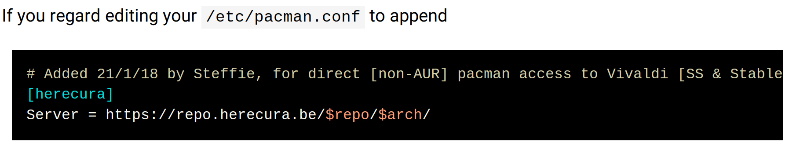

- [[Artix]] Vivaldi installation and AUR #ArchLinux
	- [This Reddit post](https://www.reddit.com/r/artixlinux/comments/ve00lw/can_not_find_artixarchlinuxsupport/) showed it.
	- [Enable Universe Repo](https://wiki.artixlinux.org/Main/Repositories#Universe)
	- Add [artix-archlinux-support](https://dev.to/nabbisen/artix-linux-add-arch-linux-repos-extra-community-35ab)
	- 
	- Enable herecura repo
		- {:height 120, :width 463}
		-
	- Online course creation platforms supporting RTL #[[Online Course Platforms]]
		- [OpenLearning](https://solutions.openlearning.com) (don't particularly like)
		- [TalentLMS](https://www.talentlms.com)
		- [Kajabi](https://kajabi.com) used by [Anki Mastery Course](https://courses.ankipalace.com)
		-